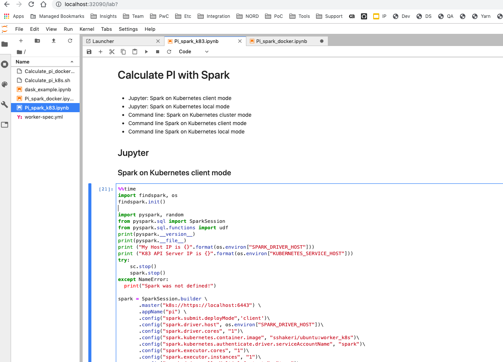

# Containerized Spark on Kubernetes & Docker

## Quickly setup various spark configs running on Kubernetes & Docker Desktop

* Containerized Spark 2.4.3 with K83 API server as master for auto provisioning of drivers and workers from Jupyter in client mode. 
* Cluster, client and local mode equivalent using command line and Jupyter
* Docker standalone version with no K83 dependency

## Image Specs
* Spark 2.4.3
* JDK 8
* Python 3 on Conda with Jupyter lab, pyarrow & pandas, and Dremio ODBC and JDBC Drivers in the image
* Helm charts for k83 setups

Note: *You must mount your own storage or your changes reset when containerized shut down*
 

## Install

Prerequisites
* Docker ( [Desktop](https://www.docker.com/products/) version if you want to try on your laptop)
* A Kubernetes cluster. You can use Docker Desktop Kubernetes. *For best results you need 8 cores 16 GB Memory*

* Install [helm](https://github.com/helm/helm)
### Using Helm (Kubernetes)
 #### Init & Install
    helm init
    helm install --name spark ./charts  -f  ./charts/values.yaml
navigate to [http://localhost:32090/](http://localhost:32090/) to access Jupyter
 #### Upgrades if values need to be updated
    helm upgrade -f  charts/values.yaml spark charts/
 #### delete 
    helm delete spark --purge
## Using Docker (No Kubernetes)
Install Docker for desktop. Run the following commands. 
 #### Network
    docker network create spark_network

Run these commands in 3 different shells and keep them open, you see the logs as the servers get the requests

 #### Master
    docker run --rm -it --name spark-master --hostname spark-master -p 6077:7077 -p 6080:8080 --network spark_network sshakeri/ubuntu:spark_master 
#### 1 Worker
    docker run --rm -it --name spark-work --hostname spark-worker --network spark_network sshakeri/ubuntu:spark_worker 
#### Jupyter
    docker rund --rm -it --name jupyter --hostname jupyter -p 6090:6660 --network spark_network sshakeri/ubuntu:jupyter 

navigate to [http://localhost:32090/](http://localhost:6090/) to access Jupyter

    
   

## Credits
Inspired by the work in these repos

https://github.com/apache/spark/blob/master/resource-managers/kubernetes/docker/

https://github.com/dbanda/charts

https://github.com/Azure/mmlspark

https://github.com/jupyterhub/zero-to-jupyterhub-k8s/issues/1030

